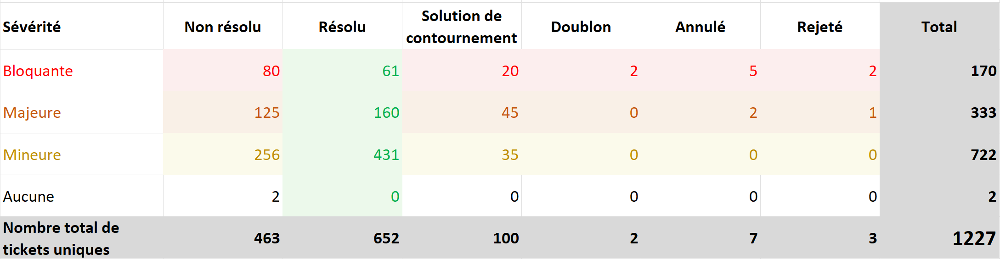
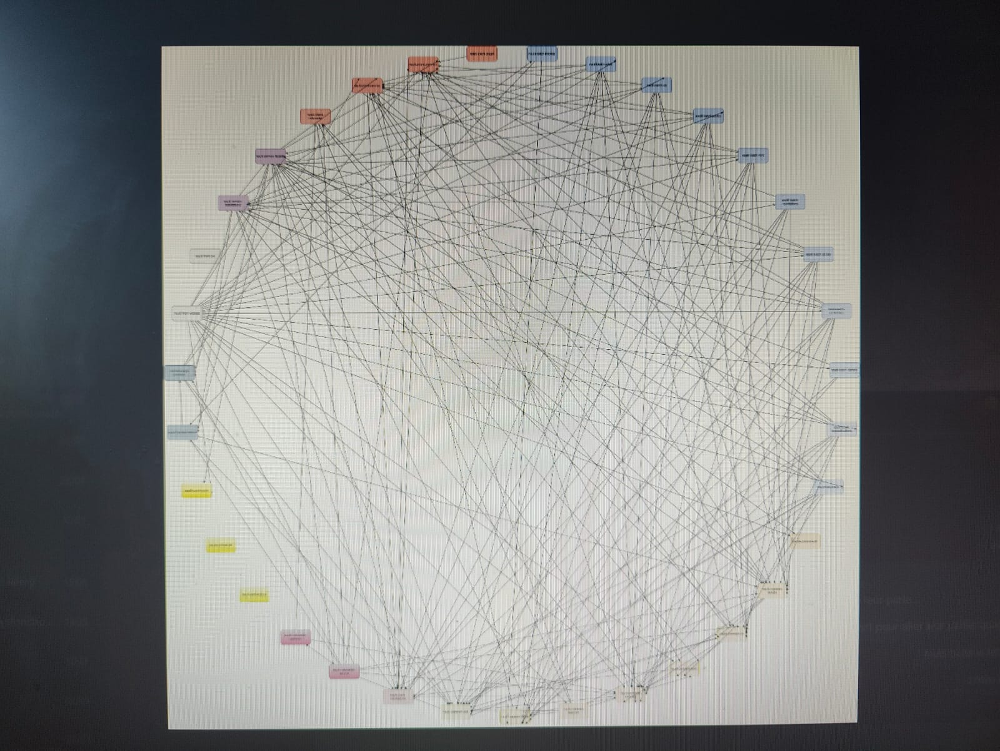
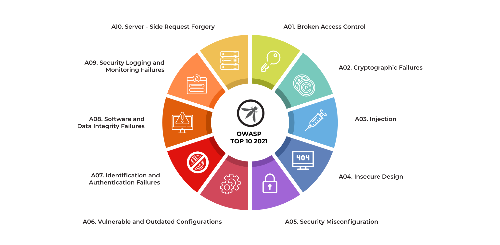

# Audit d'application

><i>Article écrit par Salim CHAMI [@salimchami](https://github.com/salimchami/) (30 mn de lecture).</i>

> **Mon Manager N+3 Laure** : "Salut ! tu voudrais faire l'audit de code d'une application ?"  
**Moi** : "Salut Laure ! quels problèmes ils ont ?"  
**Laure** : "Je ne sais pas trop.
> Le PM m'a dit qu'ils avaient de gros problèmes de qualité de code...
> Je lui dis que t'es d'accord ?"  
**Moi** : "Et bien, il faut que je me dégage du temps parce que là, je suis sur l'application X, je travaille aussi sur
> la scalabilité de l'application Y. D'ailleurs, je crois qu'il y a un problème dans nos process de déploiement
> auto..."  
**Laure**: "Oui... il faut qu'on en parle.
> Je t'envoie un mail avec Rémy le PM de l'application en copie ?
> Il t'enverra les infos !"  
**Moi**: "Ok. avec plaisir."  
**Laure** : "Merci, c'est sympa !"

Étant convaincu que j'allais faire un audit de code, une sorte de code review mais un peu plus long que d'habitude, je
me suis mis à programmer une journée ou deux la semaine suivante pour le faire.

Le lendemain matin, j'ai reçu un mail de Léo le PO me présentant en deux phrases le métier de l'application et me
demandant les prérequis pour réaliser l'audit.

Avec mon entrain habituel, je lui répondis quelques secondes après pour lui lister les actions nécessaires pour le
réaliser :

- L'objectif et la population cibles de l'audit
- Le domaine métier avec une description succincte des principales fonctionnalités
- Les cas d'utilisations des fonctionnalités les plus pertinentes
- Accès Git
- Accès CI/CD
- Accès outils de documentation
- Accès outils de monitoring

J'ai écrit ce mail en me disant que j'avais sûrement oublié quelque chose...
Je me dis qu'il serait intéressant aussi que j'aie un entretien avec un tech.

> **Moi, sur le chat de l'entreprise** : "Léo, s'il te plait, il faudrait aussi que je parle à un tech de l'équipe.
> Ne serait-ce que pour démarrer l'application en local."  
**Léo** : "Ils ne sont pas au courant de l'audit.
> C'est assez compliqué..."  
**Moi**: "Ah oui, il faudrait au moins en parler à une personne tech.
> Bon Ok. pas de problème.
> Merci!"

Je change d'onglet et contacte Rémy pour lui demander des explications supplémentaires.

> **Moi** : "Salut Rémy.
> Je voudrais s'il te plaît avoir plus d'infos à propos de l'audit.
> On m'a dit que je ne pouvais pas contacter l'équipe de dév.
> Je me demandais donc à qui il va être destiné ?"  
**Rémy une heure après** : "Salut !
> On voudrait transférer le projet à une autre équipe et comme, contractuellement, c'est difficile avec la société
> travaillant sur l'appli actuellement, il nous faudrait un audit pour rompre le contrat.
> Et une stratégie de remédiation aussi !"  
**Moi, dans mes pensées** : "Ah !
> Un audit sans parler à l'équipe de dév...
> Comme quand on interdit au développeur de contacter le PO..."

Cette fiction peut être bien réelle dans les entreprises.
Les managers et les PM/PO considèrent le logiciel comme une boîte noire, et en tant qu'auditeur, nous devons les aider 
à comprendre les processus de développement.

Par ailleurs, si un audit est réalisé sur une application, l'équipe de dév devrait être la première dans la boucle, et
doit avoir le recul nécessaire pour accepter cet audit.
Si ce n'est-elle qui en fait la demande.

Dans cet article, je vais tenter d'expliquer ce qu'est un audit applicatif en exposant tous les aspects devant être pris
en compte pour le réaliser et pour écrire un compte rendu.

## Définition

L'audit applicatif est une évaluation des applications et des logiciels d'une organisation 
pour vérifier leur efficacité, leur conformité aux normes de bonnes pratiques de développement, 
de sécurité et de respect de l'environnement ; leur adéquation aux objectifs de l'entreprise,
afin d'identifier les possibilités d'amélioration.  

## L'élément déclencheur

Comme dans notre fiction, plusieurs types de besoins amènent le client, les managers ou les équipes de développement à
prendre la décision de réaliser un audit applicatif.
Voici une liste non exhaustive des différents événements à l'origine d'un besoin d'audit :

- Retours client/utilisateurs négatifs
- Des délais de changements (évolutions) trop longs
- Un taux d'échec de ces changements élevé
- Un temps moyen de restauration après incident trop élevé et complexe
- Reprise d'un legacy non évolutif
- Modernisation de legacy : Dans ce cas, les équipes désirent simplement moderniser l'application même si celle-ci
  fonctionne correctement
- Remboursement d'une dette technique importante
- Trop de defects détectés même avant la mise en production
- ...

Ces causes vont nous permettre de déterminer l'objectif de l'audit et la population à laquelle il est destiné.
Cependant, les demandeurs devraient être capables de déterminer cet objectif ce qui permettra une bonne coopération
entre la personne auditrice, l'équipe de dév et les équipes managériales.

## A. Prérequis et supports utilisés

Pour conduire notre audit, il est nécessaire d'avoir une série d'éléments à notre disposition.

### A.1. Objectif

L'objectif de l'audit est un élément important, car il va nous permettre d'orienter les comptes rendus.
Nous n'exposons pas de la même manière les problèmes techniques détectés à un développeur et à un manager qui méconnaît
trop souvent les éléments mis en œuvre lors du développement d'un service IT.

Une liste d'objectifs possibles serait une réponse naturelle aux éléments déclencheurs cités plus haut :

- Améliorer l'expérience utilisateur
- Réduction des temps de changements (évolutions)
- Réduction du taux d'échec de ces changements
- Réduction du temps moyen de restauration après incident
- Reprise de legacy
- Remboursement d'une dette technique importante
- Corriger et minimiser les defects détectés
- Transfert de MOE (comme dans notre fiction)
- ...

### A.2. Population cible

Outre l'objectif de l'audit, pour démarrer notre analyse, la connaissance de la population cible nous permet d'orienter
la manière dont sont écrites les synthèses du rapport.
Cependant, l'analyse et les préconisations ne devront pas en être impactées.

- Managers,
- Équipes de développement,
- Clients (selon le type de l'entreprise et du projet).

### A.3. Domaine métier

Le domaine métier est la pierre angulaire de notre audit.
Un logiciel est créé pour répondre à un besoin métier et nous ne devons pas le perdre de vue tout au long de l'audit.

Une présentation succincte du domaine métier avec la liste des fonctionnalités principales/les plus critiques sous forme
de cas d'utilisations est nécessaire.  
Cela nous permet de réaliser une analyse de code toujours à partir de besoins fonctionnels.
Dans le cas où des tests fonctionnels automatisés type Cucumber sont présents, nous pouvons omettre de demander ces cas
d'utilisations.
Ces tests doivent bien entendu couvrir l'ensemble des fonctionnalités ou au minimum les fonctionnalités critiques.

### A.4. Accès dépôt de code source (Git)

Le repository GIT permet d'avoir accès au code de l'application.

Éventuellement, le repo peut contenir du code d'infrastructure qu'il est intéressant d'analyser.

### A.5. Accès CI/CD

L'accès à la chaîne d'intégration et/ou de déploiement continus est également nécessaire et permet d'analyser le
processus de mise à disposition de l'application aux utilisateurs.

Ainsi, ce sont les jobs de build, de déploiement et de tests, s'ils existent, qui peuvent être analysés.

### A.6. Tests de charge

Les tests de charges nous permettent de disposer de cas d'utilisation et de métriques de performance.
Pour rappel, un test de charge est exécuté sur la back d'une application en faisant des appels d'API (REST par exemple).
Il existe plusieurs types de tests et chaque cas d'utilisation peut être testé avec chacun de ces types.

- Soak test : Test simple d'un cas d'utilisation avec un utilisateur faisant qu'un seul appel.
  Il permet de contrôler si l'application se dégrade avec le temps, mais aussi si le cas d'utilisation fonctionne
  toujours.
- Stress tests : Test permettant d'augmenter soudainement la charge sur une api.
  Permet d'analyser le comportement de l'application lors d'un pic d'utilisation à un moment donné
- Capacity tests : Test permettant d'analyser le comportement de l'application soumise à une charge en constante
  évolution.

### A.7. Tableaux de bord de suivi

Il existe plusieurs types de tableaux de bord de suivi.
Il peut s'agir de board Scrum, Kanban...
Ce sont les graphiques
issus de ces boards qui sont intéressants et apportent des informations précieuses, car ils démontrent le déroulement du
développement de l'application.

#### A.7.a. Rapport d'anomalies

Le rapport d'anomalies contient les status des tickets ouverts de type "Bug" et représentés en deux dimensions : La
sévérité des tickets et leur statut.

##### Exemple de rapport d'anomalies

#### A.7.b. Carte thermique

Un des schémas faisant ressortir les thèmes récurrents présents sur les tickets est la carte thermique.
Elle contient les mots-clés (étiquettes) les plus utilisés et donc les fonctionnalités les plus sensibles.

#### A.7.c. Tickets créés vs. tickets résolus et Diagramme de flux cumulatifs

Le premier diagramme représente le volume des tickets "à faire", créés et les tickets résolus dans le temps.
Il est donc intéressant d'y relever l'écart entre ces deux variables.

##### Exemple diagramme Tickets créés vs. tickets résolus

Le diagramme de flux cumulatifs est similaire au diagramme ci-avant, mais peut contenir de multiples status de tickets
supplémentaires.
Exemple ici](https://support.atlassian.com/jira-software-cloud/docs/view-and-understand-the-cumulative-flow-diagram/).

#### A.7.d. Diagramme de contrôle

Ce diagramme affiche la variabilité et la stabilité des délais de livraison des tâches.
Il fournit des informations sur la performance de l'équipe et permet d'identifier les tendances.

##### Exemple diagramme de contrôle

Il représente le lead time énoncé dans les métriques DORA.

#### A.7.e. Métriques DORA

Si le projet tient un board de métriques DORA, il peut être très intéressant de l'analyser.

Les métriques DORA aident à évaluer l'efficacité et la maturité des pratiques DevOps en évaluant les performances DevOps
avec quatre mesures clés :

- **Déploiements fréquents** : Mesure la fréquence des déploiements réussis.
- **Délai de mise en production (lead time)** : Mesure le temps nécessaire pour passer du développement à la mise en
  production.
- **Temps de rétablissement des services** : Mesure le temps moyen pour rétablir un service en cas d'incident.
- **Taux d'échecs des changements** : Mesure la fréquence des échecs lors des déploiements.

Il existe de nombreux outils pour mesurer ces métriques :

- [Jellyfish](https://jellyfish.co/)
- [Oobeya](https://www.oobeya.io/)
- [Linearb](https://www.linearb.io/)
- [Swarmia](https://swarmia.com/)
- ...

#### A.7.f. Autres graphiques

Les outils de suivi de projet permettent la génération d'une multitude de graphiques.
Certains peuvent être ignorés, car ceux cités ci-dessus suffisent.
Par exemple, "un burn down chart" d'un seul sprint ne permettra pas de tirer des conclusions pertinentes sur le
déroulement du développement, parce que les estimations sont propres à chaque équipe à moins d'en superposer plusieurs
en prenant en compte le contexte du projet.
Les graphiques d'âge moyen des tickets et de la durée de résolution complétés par des boards de métriques DORA
permettent en général d'arriver aux mêmes conclusions.

### A.8. Documentation

Toute documentation qui permettrait d'apporter des informations sur le domaine métier et/ou les process techniques est
intéressante à prendre en compte.
L'absence de documentation n'est pas un point bloquant pour la réalisation de l'audit.

La documentation peut donc contenir des informations techniques et fonctionnelles qu'il est primordial d'exploiter.

#### A.8.a. Documentation technique

La documentation technique contient l'ensemble des documents/articles techniques concernant le projet.
Elle peut être
déclinée sous plusieurs formats.

##### Dossier d'architecture technique (DAT)

Le DAT est un document qui décrit en détail l'architecture technique d'une application, incluant les objectifs, la
structure, les composants et les technologies utilisées.
Il est essentiel à l'analyse de l'architecture technique.

En effet, il permet de détecter les dépendances entre les applications et les composants techniques,
leur mode de communication, les flux de données, les types des applications communicants avec l'application auditée (
web, batch, API...).

Il contient également les informations relatives à l'infrastructure (serveurs, bases de données, zones réseaux...) et
éventuellement des explications des principaux principes et décisions architecturales.

En résumé, le DAT est une vue d'ensemble des principaux composants techniques du système.
Il fournit une référence pour la conception, le développement et l'évolution du système.

##### Document d'exploitation (DEX)

Le DEX d'une application est un document qui fournit des informations essentielles sur l'utilisation, la configuration
et la maintenance de l'application.
Il sert de guide pour les opérateurs, les administrateurs ou les utilisateurs finaux
afin de les aider à comprendre et à exploiter correctement l'application.
Il peut être utilisé, par exemple, lors de l'installation de l'application ou d'une reprise sur incident.

##### Modèle de base de données

Le modèle de base de données est un document contenant la structure de la base de données (tables, relations,
cardinalités, formes normales...).
D'autres éléments sont nécessaires à l'analyse, tels que les index, éventuellement les procédures stockées (si elles
existent), et les séquences, les vues (et les requêtes de leur création).

##### Diagrammes UML (Unified Markup Language)

Les diagrammes UML sont des représentations visuelles utilisées pour modéliser un logiciel.
Ils fournissent une vue
claire et concise des différentes parties et interactions d'un système.
Le site officiel est le
suivant : [uml.org](https://www.uml.org/)

##### Architecture Decision Records (ADR)

Les ADR sont des enregistrements qui documentent les décisions d'architecture prises lors du développement d'une
application.
Ils fournissent une trace des choix architecturaux importants, des raisons qui les motivent et des
conséquences attendues.
Les ADR servent de référence pour comprendre le contexte et les décisions prises tout au long du
cycle de vie de l'application.

#### A.8.b. Documentation fonctionnelle

La documentation fonctionnelle contient l'ensemble des documents concernant le domaine métier de l'application.
En voici quelques exemples :

##### Documents présentation du domaine métier

Tout document présentant le périmètre fonctionnel de l'application est à prendre en compte lors de l'audit.
Ces documents sont habituellement générés par l les PO, le métier ou les chefs de projets.

De plus, les documents produits après des séances telles l'"Event storming" ou l'"Example mapping" sont intéressants à
prendre en compte pour la compréhension du domaine métier et des fonctionnalités.

##### Tests fonctionnels automatisés

Les tests fonctionnels automatisés se concentrent principalement sur la validation de la couche métier de l'application,
en vérifiant le bon fonctionnement des fonctionnalités et des scénarios métier.  
Ils sont en effet effectués au niveau de la couche de services de l'application ou dans le domaine
(cf.
[Architecture Hexagonale](https://beyondxscratch.com/fr/2018/09/11/architecture-hexagonale-le-guide-pratique-pour-une-clean-architecture/))
pour s'assurer que les différentes fonctionnalités sont correctement implémentées et répondent aux exigences métier.

Il est possible d'utiliser plusieurs outils/frameworks pour implémenter ce type de tests :
Les frameworks de tests unitaires et fonctionnels avec le format Gherkin (
cf.
[BDD](https://beyondxscratch.com/2019/05/21/behavior-driven-development-from-scratch/)).

##### Tickets Board Agile

Les tickets d'un board représentent un ensemble de tâches de plusieurs types (User story, bugs, task...) et peuvent
avoir plusieurs statuts différents (TODO, WIP, DONE).

Ces tickets, s'ils ont bien écrit, peuvent être une source d'informations importante concernant les fonctionnalités
présentes dans l'application.

Un ticket bien écrit est un ticket écrit de façon INVEST (story indépendante, négociable, avec une vraie valeur,
estimable, suffisamment petite et testable).
Une story devrait contenir des critères d'acceptation contenant des exemples issus d'un "Example Mapping" (BDD).

##### Graphes d'états transitions fonctionnels

Le métier ou les développeurs peuvent générer des graphes d'états transitions pour plusieurs notions métiers.
Par exemple, dans une application de gestion de factures, la facture peut avoir plusieurs statuts possibles et donc un
graphe d'états transitions peut être produit pour représenter le workflow fonctionnel d'une facture.

Par ailleurs, dans le cas où l'application contient une API REST et c'est [**HATEOAS
**](https://martinfowler.com/articles/richardsonMaturityModel.html#level3) qui est utilisé, l'équipe de développement
peut générer un diagramme d'états transitions pour représenter toutes les actions possibles depuis un objet json
(devenant un état dans le diagramme).  
Avec HATEOAS, il est possible de construire un diagramme d'états transitions représentant tout le **workflow fonctionnel
** de l'application.

### A.9. Monitoring / Application Performance Management (APM)

Le monitoring technique, s'il existe, peut fortement orienter l'analyse.
Il contient, en effet, beaucoup d'informations sur le fonctionnement de l'application.

Voici quelques-uns des éléments exploitables dans l'audit et fournis par ces outils :

- Transactions HTTP
- Requêtes de la base de données
- Gestion des ressources
- ...

### A.10. Anciens rapports d'audits éventuels

Éventuellement, l'application auditée peut déjà avoir fait l'objet d'un audit et dans ce cas, il est intéressant de le
consulter pour en déduire l'évolution de l'application.

## B. Analyse

Plusieurs plans d'analyse sont possibles selon les besoins, mais le plan qui suit regroupe les principaux axes d'études.

Notre phase d'étude peut donc se décomposer en deux grandes parties, une partie concernant l'organisation et la gestion
de projet (Point 1), et une deuxième partie technique.

Un des objectifs supplémentaires sur lequel l'étude peut porter est l'impact environnemental de l'application.

1. [Organisation et TTM](#b1-organisation-et-time-to-market-ttm)
2. [Structure globale de l'application](#b2-structure-globale-de-lapplication)
3. [Architecture fonctionnelle](#b3-architecture-fonctionnelle)
4. [Architecture technique](#b4-architecture-technique)
5. [Architecture logicielle](#b5-architecture-logicielle)
6. [Qualité du code](#b6-qualité-du-code)
7. [Sécurité](#b7-sécurité)
8. [Performance de l'application](#b8-performance-de-lapplication)
9. [Impact environnemental](#b9-impact-environnemental)

**N.B.** : Dans les parties ci-après, je ne parle principalement que de **points négatifs**,
mais il est bien entendu pertinent et nécessaire de noter les **points positifs** pour les prendre en compte dans les
préconisations et le rapport, car un audit est **une photographie factuelle d'une application à un instant T**.

### B.1. Organisation et Time To Market (TTM)

L'objectif du client étant de livrer un service au plus tôt et donc minimiser le Time To Market, une organisation est
établie pour produire ce service.

#### B.1.a. TTM

Il est alors important de connaître le temps de mise sur le marché prévu et le temps réel (lead time) en fonction de
l'organisation effective du développement.

L'analyse de cette organisation est donc nécessaire afin de détecter certains points d'améliorations en fonction des
objectifs.
Il est utile également de relever les points positifs.
Par exemple, si le TTM réel est celui qui est prévu par le métier ou les managers.

***À analyser*** :

- Respect du TTM prévu et réel

#### B.1.b. Expression du besoin

Dans la majorité des équipes de développement, un board de gestion de tickets est utilisé.
L'expression de besoin est souvent faite directement sur les tickets en respectant un certain formalisme tel que le
langage [Gherkin](https://cucumber.io/docs/gherkin/reference/).
Le point à relever est donc le respect systématique d'un format pour les tickets créés.

Il est à relever également si les critères d'acceptation sont pertinents et formulés avec des exemples concrets.

Ces points sont importants, car ils peuvent freiner ou ralentir le développement.
En effet, des tickets mal conçus peuvent favoriser l'incompréhension des fonctionnalités par l'équipe de développement.

***À analyser*** :

- Respect d'un formalisme lors de l'écriture de "user stories"
- Exemples concrets dans les critères d'acceptation

#### B.1.c. Tableaux de bord de suivi

##### Analyse du Rapport d'anomalies

L'équipe de développement peut délivrer rapidement et régulièrement, mais peut aussi faire face à de nombreux bugs
détectés lors de l'utilisation de l'application.

Prenons l'exemple suivant avec un rapport d'anomalies sur une période de 12 mois.
Si nous cherchons le nombre moyen de bugs par jour, on obtiendrait 1104 / 220 = 5 bugs.
Ce qui semble élevé.

Le même calcul peut être fait pour chacun des types d'anomalies (Non résolu, résolu...).

Un nombre moyen élevé de bugs signifie que la non-régression n'est pas assurée, que l'application est non évolutive.
Cela peut être dû à :

- Manque de tests automatisés
- Code complexe (Big ball of mud)
- Méthodes de déploiements complexes
- Dépendances/couplage internes à l'application (entre classes, modules...) ou avec d'autres applications
- ...

***À analyser*** :

- Chaque statut séparément : par exemple le nombre d'anomalies non résolues
- Lien entre les statuts : par exemple le ratio entre le nombre d'anomalies non résolues et résolues.
- Le nombre moyen de bugs par jour

##### Analyse tickets créés vs. tickets résolus

L'écart entre les tickets créés et les tickets résolus est un indicateur de la vélocité de l'équipe de développement.
Il ne s'agit pas ici du nombre de points traités, mais bien du nombre de tickets.
En effet, un ticket peut être très complexe et nécessiter beaucoup de points, mais un autre ticket peut être très simple
et nécessiter peu de points.

Dans le premier graphique, les deux courbes sont très proches, ce qui signifie que l'équipe de développement est très
efficace.
Dès qu'un ticket est créé, il est résolu rapidement.

Dans le deuxième graphique, la courbe de tickets créés est supérieure à celle des tickets résolus.
Cela signifie que l'équipe de développement n'est pas assez efficace et que le nombre de tickets à faire augmente.

A contrario, si la courbe des tickets résolus est supérieure à celle des tickets créés, cela signifie que l'équipe de
développement est très efficace même si le nombre de tickets à traiter augmente.

***À analyser*** :

- Écart entre la courbe des tickets créés et celle des tickets résolus
- Linéarité des deux courbes peut être intéressante à analyser également

##### Analyse de diagrammed contrôle

Dans ce diagramme de contrôle, nous pouvons voir que le certains tickets sont traités en 40 jours.
Ce qui peut être considéré comme beaucoup trop long.
Cela peut avoir plusieurs significations :

- Besoin trop complexe ou non compris
- Application/Architecture applicative non évolutive

Ce diagramme permet également de mesurer l'effet d'un changement de la productivité de l'équipe de développement.
Par exemple, si le code a été simplifié ou l'équipe de développement a amélioré sa méthode de développement, nous
devrions voir une diminution du temps de traitement des tickets.

***À analyser*** :

- Présence de clusters de tickets
- Temps moyen de traitement des tickets
- Évolution du temps de traitement des tickets

##### Analyse de métriques DORA

Les métriques DORA sont à analyser ensemble.
En effet, une amélioration de l'une d'entre elles peut avoir un impact sur les autres.

Les équipes performantes ont un temps de déploiement plus court, ce qui permet de réduire le temps de réaction en cas
d'anomalie.
Cela permet également de réduire le temps de mise en production d'une nouvelle fonctionnalité.

***À analyser*** :

- Chaque métrique séparément
- Lien entre les métriques
- Évolution des métriques

#### B.1.d. Feedback des utilisateurs

Le feedback des utilisateurs est un indicateur important de la qualité de l'application.
En effet, si les utilisateurs sont satisfaits de l'application, cela signifie que l'application répond à leurs besoins.
Le feedback des utilisateurs permet, lors de l'analyse, de détecter les besoins fonctionnels de l'application posant un
problème.

Il existe plusieurs moyens de récolter le feedback des utilisateurs :

- Enquêtes de satisfaction
- Analyse des tickets utilisateurs
- Analyse des commentaires sur les stores (Google Play, App Store...)
- Analyse des commentaires sur les réseaux sociaux (publiques, d'entreprise...)
- ...

***À analyser*** :

- Retours positifs ou négatifs des utilisateurs
- Nombre de retours positifs/négatifs
- Nombre de retours positifs/négatifs par fonctionnalité
- Nombre de retours positifs/négatifs par version de l'application
- Nombre de retours positifs/négatifs par type d'utilisateur (client, administrateur, support...)
- Nombre de retours positifs/négatifs par canal (enquête, ticket, réseaux sociaux...)
- ...

### B.2. Structure globale de l'application

#### B.2.a. Modèle de base de données

Il est important de modéliser correctement la base de données de l'application.
Si un modèle de données est mal conçu, cela peut avoir un impact sur les performances et l'évolutivité de l'application.

Le modèle de données doit être le plus simple possible et ne doit pas contenir de redondance fonctionnelle.

Pour cela, il est possible de vérifier les formes normales.  
Plus le modèle de données est normalisé, plus il est simple et évolutif.
Si le modèle est dénormalisé, il est possible que ce soit fait intentionnellement pour des raisons de performance.

Il est important également de vérifier le contenu des tables (types, index, clés primaires et étrangères...).

***À analyser*** :

- Formes normales
- Les clés primaires et étrangères sont bien définies.
- Les index sont bien définis.
- Les contraintes d'intégrité sont bien définies.
- Les types de données sont bien définis.
- Les champs obligatoires sont bien définis.

#### B.2.b. Diagrammes UML

S'il existe des diagrammes UML, il est important de les analyser.
S'ils n'existent pas, il est possible de les générer à partir du code source.

Si, par exemple, un diagramme de classes contient un nombre important de classes, cela peut signifier que le code est
complexe et difficile à maintenir.
Outre le diagramme de classes, un diagramme de séquence peut aussi faire ressortir des problèmes de design.

***À analyser*** :

- Complexité des différents diagrammes UML de l'application

#### B.2.c. Structure des modules de l'application

Les modules de l'application sont les modules gérés par un gestionnaire de dépendances (Maven, Gradle, npm...).
La structure des modules de l'application permet de détecter les dépendances entre les modules.
Un diagramme de dépendances peut être généré à partir de la structure des modules.

Si de nombreuses dépendances existent entre les modules, cela peut signifier que l'application est peu évolutive.

Exemple de diagrammes présentant des interdépendances entre les modules d'une application :

L'application contient beaucoup trop de modules.
Elle contient même des modules orphelins.  
Il est possible donc qu'elle contienne des défauts de design.

***À analyser*** :

- Nombre de modules
- Dépendances entre les modules : dépendances techniques et fonctionnelles
- Dépendances cycliques entre les modules
- Dépendances bidirectionnelles entre les modules : Techniquement impossible, mais des modules peuvent s'appeler
  mutuellement par des web services.
- Dépendances entre les modules et les librairies externes
- Dépendances entre les modules et les bases de données
- Dépendances entre les modules et les fichiers de configuration
- Dépendances entre les modules et les ressources (images, vidéos, fichiers de traduction...)
- Dépendances avec les plateformes de développement : En effet, le code source ne doit contenir aucun fichier de
  configuration relatif aux IDE.

#### B.2.d. Structure des packages contenant les classes

Les packages contenant les classes permettent de détecter les dépendances entre les classes.

De préférence, un package doit concerner une seule fonctionnalité.
En effet, l'arborescence des packages doit être cohérente avec les différents périmètres fonctionnels.

***À analyser*** :

- Nombre de packages
- Dépendances entre les packages
- Dépendances bidirectionnelles entre les packages
- Dépendances entre les packages et les librairies externes
- ...

### B.3. Architecture fonctionnelle

Il est nécessaire d'étudier le découpage des différents périmètres fonctionnels (Bounded contexts).

Pour cela, le diagramme d'architecture fonctionnelle peut être utilisé s'il existe.
Il permet de détecter les dépendances entre les périmètres fonctionnels de l'application.

Si, par exemple, une double flèche (bidirectionnelle) existe entre deux applications,
cela signifie que le design présente quelques points négatifs.

Les applications présentes dans le diagramme d'architecture
fonctionnelle sont également à analyser en prenant en compte leur utilité fonctionnelle.

Les questions suivantes peuvent être posées :

- Est-ce que le découpage fonctionnel est cohérent (sans couplage) ?
- Est-ce que les applications sont bien nommées ?

***À analyser*** :

- Nombre d'applications
- Dépendances entre les applications
- Dépendances bidirectionnelles entre les applications
- Emplacement des applications dans les zones du réseau local (DMZ, LAN...)
- ...

### B.4. Architecture technique

C'est le DAT et le DEX qui permettent l'analyse de l'architecture technique de l'application.

#### B.4.a. Architecture globale

La compréhension de l'architecture globale de l'application, y compris les composants principaux,
leurs interactions et leurs dépendances, est essentielle.
L'évaluation porte sur la conception de l'architecture, sa capacité à répondre aux besoins
du système et sa scalabilité.

***À analyser*** :

- Type d'architecture : monolithique, microservices, n-tiers, SOA, EDA...
- Interactions et dépendances entre les composants
- Scalabilité en fonction de la volumétrie des données et du nombre d'utilisateurs
- Code source de l'infrastructure (IaC)

#### B.4.b. Configuration matérielle et logicielle

Il est nécessaire de vérifier si les spécifications matérielles et les versions des logiciels utilisés
sont adéquates pour prendre en charge l'application.
L'optimisation des configurations et le respect des exigences de performance et de sécurité doivent être assurés.

***À analyser*** :

- Spécifications matérielles
- Versions des logiciels utilisés
- Optimisation des configurations
- Respect des exigences de performance et de sécurité

#### B.4.c. Interfaces et protocoles

L'évaluation porte sur les interfaces utilisées par l'application et les protocoles de communication.
Il est important de s'assurer de leur normalisation, de leur sécurité et de leur documentation adéquate.
La protection des interfaces externes et la mise en place de contrôles d'accès doivent être vérifiées.

***À analyser*** :

- Interfaces utilisées par l'application
- Protocoles de communication
- Normalisation des interfaces
- Sécurité des interfaces
- Documentation des interfaces
- Protection des interfaces externes
- Contrôles d'accès

#### B.4.d. Sécurité

L'analyse se concentre sur les mesures de sécurité mises en place pour protéger l'application.
La gestion des identités, les mécanismes d'authentification, les contrôles d'accès et la gestion
des vulnérabilités sont examinés.
Les éventuelles faiblesses de sécurité sont identifiées et des recommandations d'amélioration sont formulées.

***À analyser*** :

- Gestion des identités
- Mécanismes d'authentification
- Sécurisation des communications (SSL/TLS, "one way" ou "two ways" ?, autorités de certification, expiration...)
- Gestion des vulnérabilités

#### B.4.e. Gestion des configurations et des versions

L'évaluation porte sur le processus de gestion des configurations et des versions des composants de l'application.
Il est important de vérifier si les bonnes pratiques de contrôle de version sont suivies et si les changements
sont correctement documentés et tracés.

***À analyser*** :

- Processus de gestion des configurations et des versions
- Vérification de présence de vaults pour les secrets
- Vérification de présence de fichiers de configuration dans le code source, les binaires, les images Docker, les
  caches...

#### B.4.f. Conformité réglementaire

Si l'application doit respecter des réglementations spécifiques (par exemple, RGPD, PCI DSS),
il est essentiel de vérifier sa conformité à ces exigences.
Il convient de s'assurer que les mesures de sécurité et de protection des données sont adéquates.

***À analyser*** :

- Conformité aux réglementations spécifiques
- Mesures de sécurité et de protection des données

#### B.4.g. Documentation et maintenance

Enfin, il est important de vérifier si la documentation technique de l'application est complète et à jour.
L'évaluation porte également sur la définition des processus d'installation, de maintenance et de support (DEX).
Les éventuelles lacunes dans la documentation ou les problèmes de maintenance doivent être identifiés.

***À analyser*** :

- MAJ de la Documentation technique
- Processus d'installation, de maintenance et de support

#### B.4.h. Scalabilité

Il convient de vérifier si l'architecture logicielle est conçue pour être évolutive.
Il faut analyser si elle peut gérer efficacement une augmentation de la charge,
en utilisant par exemple des techniques de mise en cache, de répartition de charge ou de scalabilité horizontale.

***À analyser*** :

- Mise en cache
- Répartition de charge
- scalabilité horizontale

### B.5. Architecture logicielle

#### B.5.a. Structure logicielle

Comme vu dans le paragraphe 2, la structure globale de l'application doit être évaluée,
y compris les couches logicielles et leur organisation.
Il faut analyser si la structure correspond au découpage fonctionnel et si elle est modulaire et facilement
compréhensible.

Il est nécessaire aussi de vérifier également si le type d'architecture choisi est bien respecté
(Architecture en couches, hexagonale, ports & adapters, CQRS, Event Sourcing, ...).

Dans le livre "*Clean Architecture*" de *Robert C. Martin*, plusieurs principes concernant les composants sont énoncés (
Cohésion, couplage...).
Il faut vérifier si ces principes sont respectés.

Enfin, il est intéressant d'identifier le type de gestion des connexions (système ouvert ou fermé).
Un système ouvert accepte toutes les connexions entrantes
contrairement à un système fermé qui met des utilisateurs en attente si la charge devient trop élevée.

***À analyser*** :

- Couches logicielles
- Organisation des couches logicielles
- Modularité
- Facilité de compréhension
- Respect du type d'architecture choisi
- Cohésion et couplage des composants

#### B.5.b. Design patterns

Les design patterns utilisés dans l'architecture logicielle doivent être identifiés.
Il convient de vérifier si ces modèles sont appropriés pour résoudre les problèmes spécifiques
des fonctionnalités de l'application et s'ils favorisent la maintenabilité et la réutilisabilité du code.

***À analyser*** :

- Design patterns utilisés
- Appropriation des design patterns
- Maintenabilité et réutilisabilité du code

#### B.5.c. Communication entre composants

Les mécanismes de communication entre les différents composants de l'application, tels que les interfaces, les API et
les services, doivent être analysés.
Il faut vérifier si la communication est bien définie, fiable et sécurisée.

***À analyser*** :

- Mécanismes de communication entre les composants
- Définition, fiabilité et sécurité de la communication

#### B.5.d. Gestion des données

La façon dont les données sont gérées dans l'application doit être évaluée.
Il est intéressant d'analyser les mécanismes d'accès aux données et les stratégies de persistance.

***À analyser*** :

- Mécanismes d'accès aux données
- Stratégies de persistance
- Sécurité des données
- Gestion des transactions, erreurs, logs, caches, secrets, messages, événements, tâches asynchrones, jobs...

#### B.5.e. Séparation des préoccupations

Il est important d'analyser comment les différentes responsabilités fonctionnelles et non fonctionnelles sont séparées
et
gérées dans l'application.
Il faut également vérifier si la logique métier est séparée de la logique d'infrastructure (API, frameworks...).

***À analyser*** :

- Séparation et définition des responsabilités
- Séparation de la logique métier et de la logique d'infrastructure
- Cohésion et couplage

#### B.5.f. Extensibilité

Il convient d'évaluer si l'architecture logicielle permet l'ajout de nouvelles fonctionnalités ou de nouveaux composants
de manière modulaire et sans impact sur les fonctionnalités existantes.
Il faut vérifier si l'architecture est flexible et ouverte à l'extension future.

***À analyser*** :

- Possibilité d'ajout de nouvelles fonctionnalités ou de nouveaux composants (évolutivité)
- Modularité
- Flexibilité
- Ouverture à l'extension

#### B.5.g. Documentation

Il est important de vérifier si la documentation de l'architecture logicielle est complète et à jour.
Il faut analyser si elle fournit des informations claires sur les choix d'architecture (ADR),
les principaux composants et leur fonctionnement.
Il convient d'identifier les éventuelles lacunes dans la documentation et de recommander des améliorations.

***À analyser*** :

- Documentation de l'architecture logicielle (Diagrammes, ADR...)
- Principaux composants et leur fonctionnement

### B.6. Qualité du code

En filigrane de l'analyse du code, l'idéal est d'avoir comme référentiel les nombreux livres écrits à ce sujet.
Le premier est celui de *Robert C. Martin* : "*Clean Code*".
Je ne vais pas lister les différents éléments énoncés dans ces livres (design, naming, commentaires, couplage, tests...),
mais plutôt les techniques à utiliser.

#### B.6.a. Design

Il est essentiel d'analyser le design en prenant en compte les principes du DDD. Pour cela, il est
nécessaire de se poser les questions suivantes :

- Est-ce que le modèle des objets utilisés est anémique (cf. DDD tactique) ?
- Les "bonded contexts" sont-ils bien identifiés et définis ?
- Un langage ubiquitaire (Ubiquitous langage) est-il utilisé dans chaque bounded context correspondant ? 
- Les cas d'utilisations sont-ils bien clairs, compréhensibles et facilement déductibles depuis le code ? 
- ...

#### B.6.b. Analyse statique du code

Afin d'analyser la qualité du code, il est nécessaire d'utiliser, dans un premier temps, des outils d'analyse statique
du code (SonarQube, outil intégré aux IDE...).

Ce type d'analyse permet de détecter les code smells, les vulnérabilités de sécurité, la couverture par les tests, les
duplications de code, les bugs potentiels, etc.

Il est important d'exploiter les résultats de cette analyse, car ils facilitent l'écriture des recommandations.

***À analyser*** :

- Code smells
- Vulnérabilités de sécurité
- Couverture par les tests
- Duplications de code
- Bugs potentiels
- ...

#### B.6.c. Tests automatisés

Encore maintenant, en 2023, de très nombreuses applications ne contiennent malheureusement pas ou peu de tests
automatisés.
Il est donc important d'analyser si des tests automatisés sont mis en place, correctement écrits, et s'ils sont
suffisants.

Il faut analyser si des tests unitaires, des tests d'intégration et des tests de performance (entre autres, cf.
ci-dessous) sont mis en place.

À partir des tests existants, il est parfois possible de déduire la stratégie de tests utilisée 
(TDD, tests écrits après le développement, tests écrits seulement pour atteindre un taux de couverture spécifique...). 

Types de tests :

- Tests unitaires
- Tests d'intégration
- Tests de performance
- Tests de sécurité
- Tests e2e
- Tests de mutation (mutation testing)
- ...

***À analyser*** :

- Présence, pertinence et qualité (INVEST) des tests automatisés

### B.7. Sécurité

Il existe plusieurs référentiels de sécurité, mais le plus connu est celui de l'[OWASP](https://owasp.org/) (Open Web
Application Security Project)
qui fournit une liste des 10 risques de sécurité les plus critiques pour les applications web.

Comme la majorité des applications sont des applications web, je m'intéresse uniquement à ce référentiel.

Si votre application n'est pas une application web, quelques points peuvent néanmoins être exploités.

Concernant les définitions des éléments de la liste, je vous invite à consulter le site de
l'[OWASP](https://owasp.org/www-project-top-ten/)
et spécifiquement le repo [Github](https://github.com/OWASP/Top10.git) contenant les actions à prendre en compte pour
chaque vulnérabilité.

***À analyser*** :

- Contrôle d'accès défaillants
- Défaillance cryptographique
- Injection
- Conception non sécurisée
- Mauvaise configuration de sécurité
- Composants vulnérables et obsolètes
- Identification et authentification de mauvaise qualité
- Manque d'intégrité des données et du logiciel
- Carence des systèmes de contrôle et de journalisation
- Falsification de requête côté serveur

### B.8. Performance de l'application

Pour mesurer la performance d'une application, il est nécessaire d'utiliser des outils
de monitoring (APM) et des outils de tests de charge.

#### B.8.a. APM

Il est intéressant d'analyser la qualité du code en utilisant des outils d'analyse dynamique (APM).
Il existe de nombreux APM sur le marché et sont largement utilisés.

Si ce n'est pas le cas, il est possible d'utiliser des outils open source, légers et simples d'utilisation.  
Dans ce cas, il faut avoir connaissance des fonctionnalités à exécuter dans l'application (scénarios).

L'idéal est l'exécution de tests de charge pour avoir des données suffisantes sur les APM.

***À analyser*** :

- Exploiter les statistiques d'un APM lors de l'exécution de l'application :
    - Temps de réponse
    - Durées d'exécution des méthodes, requêtes, transactions...
    - Nombre de requêtes (base de données), erreurs, logs, messages, événements...

Par exemple, il est intéressant de vérifier le nombre de requêtes SQL exécutées dans le cadre d'une transaction web.
Parfois, une seule et même requête, produisant le même résultat final, peut être exécutée plusieurs fois.
Cela devrait être détecté et remonté dans l'audit.

#### B.8.b. Tests de charge

Il est intéressant également de consulter ou de réaliser (s'ils n'existent pas) des tests de charge.
Il faut tout d'abord vérifier l'existence des types de tests (vu dans le
paragraphe [Tests de charge](#A6-tests-de-charge)),
leur pertinence et leur qualité.

L'étude des rapports produits par les outils de tests de charge sont à prendre en compte.

***À analyser*** :

- Présence des différents types de tests de charge
- Temps de réponse
- Durées d'exécution des méthodes, requêtes, transactions...
- Nombre de requêtes, erreurs, logs, messages, événements...

### B.9. Impact environnemental

L'impact environnemental est un sujet très important et à prendre en compte.
Il existe des associations et organisations qui publient une série d'actions à réaliser
pour vérifier l'impact du logiciel sur l'environnement.

Par exemple, le site [Green IT](https://www.greenit.fr/) propose une liste d'actions à réaliser lors du développement d'
une application.

Il existe également des outils analysant dynamiquement l'impact environnemental d'une application.
Ces outils sont soit [en ligne](https://www.ecoindex.fr/), soit à installer en tant que plugin du navigateur.

***À analyser*** :

- Vérifier que chaque action visant à réduire l'impact écologique est respectée

## C. Préconisations

Une fois l'analyse effectuée, il est temps de construire les préconisations pour les reprendre dans le rapport.

Les préconisations sont des actions à réaliser pour améliorer la qualité du code, de l'application, de l'architecture,
etc.
Elles sont à classer par ordre de priorité (critique, haute, moyenne, basse).

Les préconisations peuvent être de différents types :

- Techniques
- Organisationnelles
- Documentation
- Formation
- ...

Comme évoqué dans l'introduction, si un point positif est identifié, il peut être repris dans les préconisations afin de
le valoriser.

**N.B.** : Lors de la rédaction de l'analyse, il est utile de créer un paragraphe de préconisations
à la fin de chaque partie reprenant les préconisations de chaque point,
pour ensuite les reprendre en synthèse dans la partie préconisations.

### C.1. Modèle de préconisation

Le modèle de préconisation qui est intéressant est le suivant :

1. Element à améliorer
2. Bonnes pratiques (référentiel)
3. Préconisations

### C.2. Liste des préconisations par élément analysé

Pour cette partie, il est possible de reprendre le même plan utilisé dans l'[analyse](#B-analyse), et pour chaque
partie, mettre la préconisation associée.

### C.3. Scénarios de remédiation

Les scénarios de remédiation sont des actions à réaliser pour améliorer la qualité du code, de l'application, de
l'architecture, etc.
Selon l'objectif, le budget alloué au projet, l'équipe de développement, etc., il est possible de proposer plusieurs
scénarios de remédiation.
Le rapport d'analyse doit donc contenir tous les scénarios de remédiation possibles.

#### C.3.a. Correction

Le scénario de correction consiste à garder l'existant et à corriger les points négatifs.
L'équipe de développement doit être sensibilisée aux différentes pratiques de refactoring.

#### C.3.b. Refonte partielle

Dans ce scénario, il existe encore plusieurs scénarios possibles.
Mais dans tous les scénarios, il est important que les deux versions ne communiquent pas entre elles.

Il est possible de diviser l'application en deux parties, en gardant le legacy et en créant une nouvelle application.
Pour cela, il faudra orchestrer les requêtes entrantes vers la bonne application.

Dans un deuxième scénario, il est possible d'intégrer la nouvelle version à l'ancienne.

##### Risque

Le principal risque de la refonte partielle est le fait de ne pas pouvoir se débarrasser de l'ancienne version.
Une double architecture peut amener plus de complexité qu'auparavant.

#### C.3.b. Refonte globale

Si l'objectif est de refondre complètement l'application, il est possible de créer une nouvelle application et de migrer
les données de l'ancienne vers la nouvelle.
Ce scénario n'est pas toujours l'idéal, mais dépend fortement du contexte du projet.

### C.4. MOSCOW

MoSCoW est une technique de priorisation des exigences.
Elle permet de classer les exigences en fonction de leur importance et de leur urgence.

#### C.4.a. Must have this (M)

Il s'agit véritablement des points critiques, pas de question à se poser, ils doivent être traités en priorité.
Ces exigences sont, en effet, non négociables.

#### C.4.b. Should have this if at all possible (S)

Ces points apportent une vraie valeur ajoutée et/ou leur importance contribue à l'atteinte des objectifs.
La différence avec les "*Must Have*" réside souvent dans le fait que leur traitement peut être différé
dans le temps après celui des points prioritaires.

Dans ce cas, leur classement est assimilable à la case "*Important, mais non urgent*" de la matrice importance-urgence.
Et doivent ainsi être traités dans la mesure du possible.

#### C.4.c. Could have this if it does not affect anything else (C)

Il est bien de les avoir et peuvent être retirés des priorités si des choix doivent être faits.
Généralement, ils font partie des "petits plus" qui contribuent à la satisfaction client pour un coût très modéré.
Ce sont donc des exigences additionnelles de confort.

#### C.4.d. Won't have this time but would like in the future (W)

Ils sont exclus du projet, mais font partie des points qui restent dans les cartons pour un
traitement ou une intégration ultérieure.

#### C.4.e. Exemple

| M                                                                           | S                                                                                      | C                                                         | W                                                                         |
|-----------------------------------------------------------------------------|----------------------------------------------------------------------------------------|-----------------------------------------------------------|---------------------------------------------------------------------------|
| Suppression des communications bidirectionnelles entre deux applications    | Suppression du pattern d'états (State pattern) car trop complexe pour le besoin actuel | Amélioration de la gestion d'erreurs (exceptions et logs) | Remplacement de l'architecture en couches par une architecture hexagonale |
| Correction des anomalies détectées par SonarQube (bugs, code smells...)     |                                                                                        |                                                           |                                                                           |
| Déplacement de toutes les règles de gestion dans la couche métier (domaine) |                                                                                        |                                                           |                                                                           |

## D. Rapport

Une fois l'analyse effectuée et les préconisations déduites de l'analyse, il est temps de rédiger le rapport.
Le rapport peut contenir le plan suivant :

1. Introduction et présentation du projet et de l'objectif de l'audit
2. Outils et référentiels utilisés
3. Organisation
4. Structure globale de l'application
5. Architecture fonctionnelle
6. Architecture technique
7. Architecture logicielle
8. Qualité du code
9. Sécurité
10. Performance de l'application
11. Impact environnemental
12. Préconisations et plans de remédiation

Ce plan est, bien entendu, à adapter à chaque contexte de projet et de besoin.

Par ailleurs, selon la personne lisant le rapport, il est possible que plusieurs parties ne soient pas lues.
Par exemple, un manager va directement aller à la partie "Préconisations et plans de remédiation" pour connaître les
actions à réaliser.

## E. Take away

### Pré-requis (outils utilisés)

Tableau contenant le lien vers les outils utilisés pour l'audit.  
Vous pouvez le réutiliser et mettre vos propres informations (urls, chemin répertoire local, login, mot de passe...).

| Libellé                 | Url                                   | Local file Path                           | Login | Password |  
|-------------------------|---------------------------------------|-------------------------------------------|-------|----------|
| Gestionnaire de Tickets |                                       |                                           |       |          |
| Wiki                    | ex: https://mycompany.com/wiki        |                                           |       |          |
| DAT                     | ex: https://mycompany.com/project/dat | ex: /home/me/project/architecture/DAT.pdf |       |          |
| DEX                     |                                       |                                           |       |          |
| CI/CD                   |                                       |                                           |       |          |
| Rapports Gatling        |                                       |                                           |       |          |
| Monitoring              |                                       |                                           |       |          |
| APM                     |                                       |                                           |       |          |
| SonarQube               |                                       |                                           |       |          |
| Repository artifacts    |                                       |                                           |       |          |
| Repository GIT          |                                       |                                           |       |          |
| VM DEV                  |                                       |                                           |       |          |
| VM Staging              |                                       |                                           |       |          |
| VM PROD                 |                                       |                                           |       |          |
| Logs                    |                                       |                                           |       |          |

